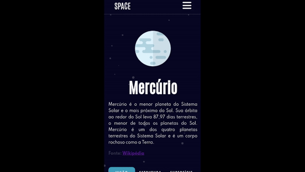

  
  <h1 align>SPACE</h1>
  
Feito puramente com HTML, CSS e JS, este desafio proposto pela <a href="https://www.frontendmentor.io/challenges/planets-fact-site-gazqN8w_f" target="_blank">Frontend Mentor</a> coleta uma série de ilustrações e informações ineressantes acerca do nossos sistema solar, podendo ser uma ferramenta de estudo ou simplesmente um site informativo.

 <h1 align="center">
  🔗 Acesse o site <a href="https://gufernandess.github.io/Space/" target="_blank">aqui</a>
</h1>
 

<h2>📋 Sumário</h2>

   * [Sobre]()
   * [Sumário]()
   * [Funcionamento]()
   * [Design responsivo]()
   * [Tecnologias]()
   * [Autor]()

<h1 align="center"> 
	🚧  Finalizado...  🚧
</h1>

<h2>🔎 Funcionamento</h2>

<h2>📱 Design responsivo</h2>

<h2>⚒️ Tecnologias</h2>

Fazendo este projeto, usei e estudei as seguintes tecnologias:

* HTML
* CSS
* Media queries e conceitos de responsividade
* JavaScript (DOM, getComputedStyle, eventHandler...)

<h2>🖊️ Autor</h2>

<a href="">
 
  
 <b>Gustavo Fernandes</b></a> <a href="">🚀</a>

Feito com ❤️ por Gustavo Fernandes!

 

